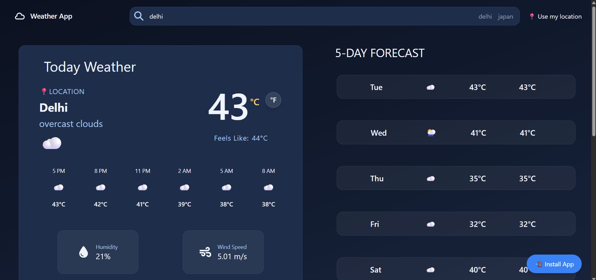

# 🌦️ Weather App

   

A modern, responsive **Weather Application** built with **React + Vite**, providing real-time weather data, hourly forecasts, and 5-day forecasts with a smooth UI and PWA support.

---

## ✨ Features

- 🔍 Search weather by **city name**
- 📍 Get weather using **current location (Geolocation)**
- 🌡️ Toggle between **Celsius & Fahrenheit**
- ⏱️ **Hourly forecast** (next 24 hours)
- 📅 **5-day forecast**
- 💾 **Recent searches** saved in local storage
- 🚀 **Progressive Web App (PWA)** – installable on mobile & desktop
- ⚡ Fast & optimized with **Vite**
- 🎨 Dynamic background based on weather conditions
- 🧠 Debounced search with request cancellation (**AbortController**)
- 📱 Fully responsive design

---

## 🛠️ Tech Stack

- **React**
- **Vite**
- **OpenWeather API**
- **Tailwind CSS**
- **React Icons**
- **PWA (vite-plugin-pwa)**

---

## 📸 Screenshots



---

## 🚀 Live Demo

🔗 **Live App:**  
https://weather-app-7cfd.vercel.app/

---

## 📦 Installation & Setup

### 1️⃣ Clone the repository

```bash
git clone https://github.com/prabhatjaidiya/weather-app.git
cd weather-app
```

### 2️⃣ Install dependencies

```bash
npm install
```

### 3️⃣ Add environment variables

Create a `.env` file in the root directory:

```env
VITE_OWM_API_KEY=your_openweather_api_key
```

Get your API key from:
[https://openweathermap.org/api](https://openweathermap.org/api)

---

### 4️⃣ Run the development server

```bash
npm run dev
```

App will be available at:

```text
http://localhost:5173
```

---

## 🏗️ Build for Production

```bash
npm run build
```

Preview the production build:

```bash
npm run preview
```

---

## 📲 PWA Support

* Installable on **Android, iOS, and Desktop**
* Offline-ready (cached assets)
* Auto-update enabled

**iOS Install:**
Share → Add to Home Screen

---

## 🧠 Project Highlights

* Debounced search to reduce API calls
* AbortController to prevent race conditions
* Skeleton loaders for smooth UX
* Error handling for invalid cities & denied location access
* LocalStorage for recent searches & last city

---

## 📂 Project Structure

```bash
src/
│── components/
│   ├── Navbar.jsx
│   ├── Card.jsx
│   ├── HourlyRow.jsx
│   ├── FiveDayForcast.jsx
│   ├── WeatherSkeleton.jsx
│   ├── ForecastSkeleton.jsx
│   └── SunriseSunsetCard.jsx
│
│── Utils.js
│── App.jsx
│── main.jsx
```

---

## ⚠️ Known Limitations

* Free OpenWeather API has request limits
* Wind gust data may be unavailable for some locations

---

## 🧑‍💻 Author

**Prabhat Jaidiya**
Frontend Developer

* GitHub: [https://github.com/prabhatjaidiya](https://github.com/prabhatjaidiya)

---

## ⭐ Support

If you like this project, please consider giving it a ⭐ on GitHub — it really helps!

---

## 📄 License

This project is licensed under the **MIT License**.